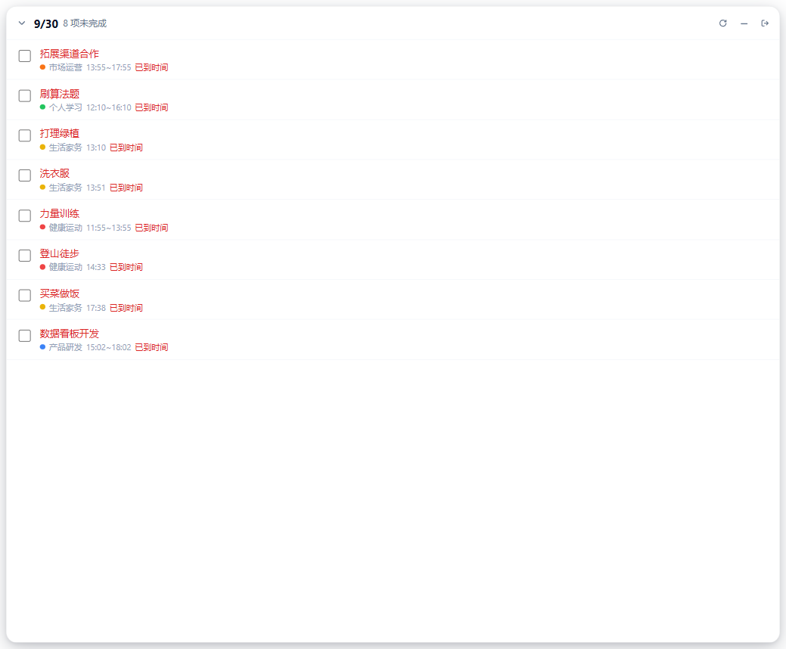

# MeiDay 桌面小组件

MeiDay 任务的 Windows 桌面小组件：无边框、透明背景的小窗，常驻桌面展示**今日未完成任务**。
网页端、Android 端与本小组件共用同一套云端数据，操作实时双向同步。

## 功能

- **实时同步**：2 秒轮询云端版本，网页端新建/完成/排序后小组件 ≤2s 自动更新；
  小组件内完成/排序也会同步回网页端。
- **仅显示今日未完成任务**：白底简洁卡片，未完成不消失，完成后立即移出列表。
- **完成任务**：勾选即完成（确认式保存，失败自动回滚并提示）。
- **拖拽排序**：拖拽调整今日顺序（跨项目顺序表 + 项目内 sort 双写，CAS 冲突合并）。
- **折叠显示**：标题栏箭头折叠为细条，再次点击展开。
- **窗口拖拽**：按住标题栏任意拖动（JS 端计算绝对坐标，跨 DPI 缩放精确）。
- **防偷窥**：对窗口持续设置 SetWindowDisplayAffinity(WDA_EXCLUDEFROMCAPTURE)，
  录屏 / 截图 / 屏幕共享时窗口内容不可见，本人屏幕正常显示。
- **自动登录**：本地保存会话，重启后自动恢复登录态并加载今日任务。

## 运行环境

- Windows 10/11
- Python 3.10+（运行 pywebview 薄壳）
- Node.js 18+（仅构建前端时使用）

## 安装与启动

`powershell
cd widget
npm install          # 首次
npm run build        # 构建前端（产物在 dist/）
python run.py        # 启动桌面小组件
`

启动后窗口常驻桌面右下区域，标题栏有「立即同步 / 隐藏到任务栏 / 退出登录」三个按钮。

## 配置

- .env.production：VITE_API_BASE_URL=https://task.congsec.cn（后端地址，构建时注入）。
- 首次登录需输入账号密码；测试可用 congsec / 12345678。

## 技术要点

- 前端：Vue 3 + Vite + Pinia + vue-draggable-plus，TypeScript 严格模式。
- 壳：pywebview（WebView2），透明无边框窗口；本机 127.0.0.1:5173 静态托管 dist/。
- 数据：与主应用相同的 OSS 存储 + 中心同步日志 + IndexedDB 缓存复用
  （同一库名/仓库/缓存键，主应用缓存可直接复用）。
- 无同步日志的账号（version=0，如测试号）：客户端引导加载全部项目 +
  每 15s 节流兜底重载，保证网页端新建/清空重灌能同步进来。

## 目录

`
widget/
  run.py                 # pywebview 薄壳：窗口 + 静态服务器 + 防偷窥
  src/App.vue            # 主界面：登录/列表/拖拽/折叠/隐藏/轻提示
  src/composables/useSyncPoll.ts  # 2s 轮询 + 引导加载 + version=0 兜底
  src/stores/            # auth / projects / tasks / stats / ui
  src/api/client.ts      # 后端 REST 客户端
  src/utils/             # oss / idb / sync / repeat / todayFilter 等
  dist/                  # npm run build 产物（不提交）
`

## 常见问题

- **任务不出现**：确认已在网页端登录过同一账号、账号下有今日任务；点「立即同步」。
- **完成/排序提示「保存失败」**：多为账号对 OSS 无写权限（如只读测试号）或网络异常，
  请使用有写权限的账号。
- **录屏看不到小组件是正常的**：这是防偷窥特性（WDA_EXCLUDEFROMCAPTURE）。
